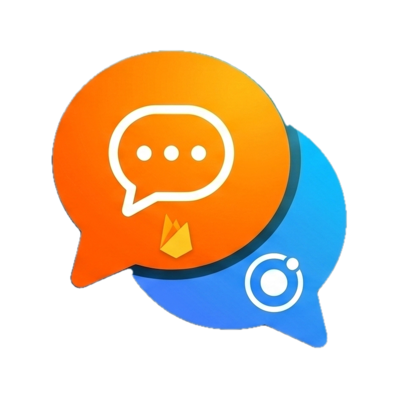

<p align="center">
  
</p>

<h1 align="center">El Ch@t</h1>
**El Ch@t** es una aplicación de mensajería multiplataforma (iOS, Android y Web) construida con tecnologías web modernas. Cuenta con autenticación segura, sincronización de mensajes en tiempo real y la particularidad de tener chats predefinidos potenciados por un modelo local de IA (Google Gemini) que responde a los mensajes del usuario.

Repositorio: [https://github.com/acastanos/elchat]
Demo en vivo: [https://deft-lily-f5d5ce.netlify.app/] (Aplicación web desplegada para probar sin entorno local)

---

## 🚀 Características Principales

*   **Autenticación Sólida:** Registro e inicio de sesión seguro usando Email/Contraseña o directamente con cuentas de Google (OAuth).
*   **Base de Datos en Tiempo Real:** Todos los chats se almacenan y sincronizan instantáneamente utilizando Firebase Realtime Database.
*   **Inteligencia Artificial Integrada:** Interactúa de forma fluida con bots basados en Google Gemini directamente dentro de chats predefinidos.
*   **Geolocalización Nativa:** Integración con Capacitor Geolocation para adjuntar la ubicación (latitud/longitud) desde la que se envía cada mensaje.
*   **Interfaz Fluida:** Diseño responsive, *infinite scroll* nativo para la carga progresiva del historial de mensajes y validación en vivo de formularios.
*   **Desarrollo Modular y Moderno:** Basada en la arquitectura de Standalone Components de Angular 17+ y el nuevo Control Flow (`@if`, `@for`).

---

## 🛠️ Tecnologías Utilizadas

*   **Frontend:** [Angular 17+](https://angular.dev/) (Standalone Components, Reactive Forms, Guards, Nuevo Control Flow).
*   **UI / UX:** [Ionic Framework](https://ionicframework.com/) (Componentes nativos y optimización de experiencia móvil).
*   **Contenedor Nativo:** [Capacitor](https://capacitorjs.com/) (Permite compilar la web app a aplicaciones nativas de iOS y Android).
*   **Backend as a Service (BaaS):** [Firebase](https://firebase.google.com/) (Auth y Realtime Database).
*   **Inteligencia Artificial:** API gratuita de **Google Gemini**.

---

## ⚙️ Cómo levantar el proyecto localmente

Para ejecutar este proyecto en tu propia máquina, necesitarás tener instalado [Node.js](https://nodejs.org/) (se recomienda la versión LTS) y preferiblemente el CLI de Ionic.

1. **Clonar el repositorio:**
   ```bash
   git clone https://github.com/acastanos/elchat.git
   cd elchat
   ```

2. **Instalar las dependencias:**
   ```bash
   npm install
   ```

3. **Arrancar el entorno de desarrollo:**
   Para evitar problemas de CORS y simular el backend *Serverless*, usamos dos terminales simultáneas:

   **Terminal 1 (Backend - Netlify):**
   ```bash
   netlify dev
   ```
   *Esto arranca el proxy seguro de las funciones de IA en el puerto 8888.*

   **Terminal 2 (Frontend - Angular):**
   ```bash
   npm start
   ```
   *Esto compila Angular y lo sirve en el puerto 4200.*

4. **Navegador:** La aplicación se abrirá en `http://localhost:4200`. Todas las peticiones a `/api` o `/.netlify` serán redirigidas automáticamente al servidor de Netlify.

---

## 🔐 Variables de Entorno y Configuración de Firebase

Por motivos de seguridad, las credenciales del proyecto de Firebase y las claves de la API de IA **no están incluidas en este repositorio** y el archivo `src/environments/environment.ts` (al igual que el `environment.prod.ts`) está ignorado por Git.

Si ejecutas el proyecto sin este archivo, Angular lanzará un error de compilación.

### ¿Cómo solicitar las variables de entorno?

Para poder ejecutar la app correctamente y conectarla a la base de datos de pruebas, necesitas contactar con el administrador del repositorio:

1. Escribe a **[@acastanos](https://github.com/acastanos)** o abre una *Issue* solicitando acceso de desarrollador.
2. Necesitarás crear **dos** archivos en tu entorno local:

**Archivo 1: `src/environments/environment.ts` (Firebase Frontend)**
```typescript
export const environment = {
  production: false,
  firebase: {
    projectId: '...',
    appId: '...',
    databaseURL: '...',
    storageBucket: '...',
    apiKey: '...',
    authDomain: '...',
    messagingSenderId: '...',
    measurementId: '...'
  }
};
```

**Archivo 2: `.env` (en la raíz del proyecto para Netlify Backend)**
```env
GEMINI_API_KEY=tu_clave_de_google_ai_studio
```

---
*Desarrollado con ❤️ para dominar el stack de Ionic + Angular + Firebase.*
