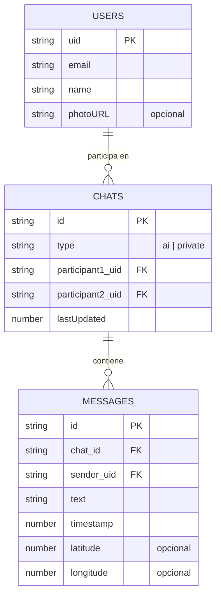

# Especificaciones Técnicas (Tech Spec): El Ch@t

## 1. Arquitectura del Sistema

El sistema utiliza una arquitectura **Serverless** basada en el lado del cliente (Frontend pesado) comunicándose directamente con servicios gestionados (BaaS).

*   **Frontend**: Angular 17+ (Modo Standalone Components) + Ionic Framework.
*   **Contenedor Nativo**: Capacitor (iOS y Android).
*   **Autenticación**: Firebase Authentication (Email/Password y Google Sign-In).
*   **Base de Datos**: Firebase Realtime Database (Base de datos NoSQL basada en árboles JSON con capacidades de sincronización en tiempo real vía WebSockets).
*   **Inteligencia Artificial**: API HTTP de Google Gemini directamente desde el cliente (con clave API segura/ofuscada o proxy, dependiendo del MVP).

### Patrón Arquitectónico en Frontend
*   `src/app/core/` *(sustituido por carpetas modulares en refactor)*: Componentes Core, interceptors globales.
*   `src/app/auth/`: Módulo de autenticación (Login, Register, Guards, AuthService).
*   `src/app/chat/`: Módulo principal (Listado, Detalle, ChatService).
*   `src/app/shared/`: Componentes reutilizables, pipes, utils.

---

## 2. Esquema de Datos (Data Schema)

Al utilizar Firebase Realtime Database, los datos se almacenan como un gran árbol JSON. Las relaciones no son SQL tradicionales, sino referencias por ID.

### Diagrama Entidad-Relación Simplificado (ERD)

### Rutas en Realtime Database (Nodos)

1.  `/users/{uid}`
    *   `uid`: String (Firebase Auth UID)
    *   `email`: String
    *   `name`: String
    *   `photoURL`: String (Opcional, proveniente de Google)
2.  `/chats/{chat_id}`
    *   `id`: String (Generado por Firebase push key o compuesto)
    *   `type`: String (`'ai'` o `'private'`)
    *   `participant1_uid`: String (Usuario A)
    *   `participant2_uid`: String (Usuario B o IA)
    *   `lastMessage`: String (Resumen del último mensaje para pintar en la lista)
    *   `lastUpdated`: Number (Timestamp UNIX)
3.  `/userChats/{userId}/{chatId}` (NUEVO)
    *   `lastRead`: Number (Timestamp UNIX indicando el último mensaje leído por ese usuario en ese chat)
4.  `/messages/{chat_id}/{message_id}`
    *   `sender_uid`: String (quien lo envió, o 'gemini-ai')
    *   `text`: String
    *   `timestamp`: Number (Timestamp UNIX)
    *   `latitude`: Number (Opcional, ubicación GPS)
    *   `longitude`: Number (Opcional, ubicación GPS)

> [!TIP]
> **Índices sugeridos (Reglas de DB):** Indexar `/chats` por `participant1_uid` y `participant2_uid` para poder filtrar los chats activos de un usuario rápidamente. Indexar `/messages/{chatId}` por `timestamp` para habilitar el Infinite Scroll bidireccional.

---

## 2.5 Gestión de Estado y Paginación (ChatService)

El núcleo de la lectura de mensajes recae en el `ChatService`, que ha evolucionado a ser **Stateful** (maneja el estado interno usando `BehaviorSubject`).

### Paginación Bidireccional
La implementación usa múltiples querys coordinadas:
1.  **Arranque Inteligente**: Al entrar al chat (`initChatState`), se obtiene el `lastRead` del usuario de `/userChats`. 
    *   Se consultan los últimos 10 mensajes *anteriores* al `lastRead` (`endBefore`).
    *   Se consultan los primeros 10 mensajes *posteriores* al `lastRead` (`startAfter`).
2.  **Scroll Histórico**: `loadOlderMessages()` busca mensajes anteriores al registro más viejo actual en el BehaviorSubject.
3.  **Scroll Futuro**: `loadNewerMessages()` busca mensajes posteriores al registro más reciente.
4.  **Tiempo Real**: Al alcanzar el tope de mensajes nuevos de la BBDD, se levanta un _listener_ de bajo coste (`onChildAdded`) escuchando mensajes entrantes en vivo.

### Workarounds Implementados
*   **Ionic Infinite Scroll**: Para evitar eventos fantasma de recarga cíclica en Angular/Ionic, se retrasa 400ms la activación visual de los Infinite Scroll (`isInitialLoadComplete`) en el `ngOnInit`.
*   **iOS Chrome Firebase Auth**: Se cambió `signInWithPopup` por `signInWithRedirect` para evitar cuelgues del popup en WebViews de iOS al identificarse con Google.

---

## 3. Contratos de "API" (Servicios / SDK)

Dado que se usa Firebase JS SDK en lugar de API REST clásica, definimos el "contrato" en base a las firmas de los servicios internos de la aplicación.

### A. AuthService (`src/app/auth/services/auth.service.ts`)
*   **`registerWithEmail(email, password, name): Promise<void>`**
    *   Crea usuario en Firebase Auth.
    *   Escribe perfil inicial en `/users/{uid}`.
*   **`loginWithGoogle(): Promise<void>`**
    *   Autentica mediante OAuth Popup.
    *   Si es la primera vez (no existe en `/users/{uid}`), lo crea con los datos devueltos por el proveedor.
*   **`userState$: Observable<FirebaseUser | null>`**
    *   Mantiene el estado de la sesión activa en toda la app.

### B. ChatService (`src/app/chat/services/chat.service.ts`)
*   **`getChatsByUser(uid: string): Observable<Chat[]>`**
    *   *Path:* Escucha la ruta `/chats` filtrando donde el usuario participe.
*   **`getMessagesPaginated(chatId: string, limit: number, lastKey?: string): Promise<Message[]>`**
    *   *Path:* `/messages/{chatId}`. OrderByChild('timestamp'), LimitToLast(10).
*   **`sendMessage(chatId: string, text: string, senderUid: string): Promise<void>`**
    *   Escribe un nuevo nodo push en `/messages/{chatId}`.
    *   Actualiza `lastMessage` y `lastUpdated` en `/chats/{chatId}`.

### C. AIService y AiOrchestratorService (`src/app/chat/services/ai.service.ts`)
Para cumplir con los requisitos de la Fase 4, la capa de Inteligencia Artificial se dividirá lógicamente en:
*   **AiOrchestratorService**: Evaluado en el arranque de la app.
    *   Verifica la existencia de los chats contra los UID `ai_mama` y `ai_churri`. Si no existen, los crea en `/users` y genera el chat.
    *   Contiene el array estático de 12 frases *hardcodeadas* de "Mamá". Lanza la frase correspondiente al detectar el evento de entrada en la app.
*   **AiService**: Servicio puro de conexión HTTP.
    *   **`generateResponse(chatHistory: Message[], botType: 'mama' | 'churri'): Promise<string>`**
    *   Inyecta en la cabecera un *System Prompt* robusto forzando el lenguaje neutral y el tono jocoso correspondiente al `botType`.
    *   *Endpoint Externo:* `POST https://generativelanguage.googleapis.com/v1beta/models/gemini-pro:generateContent`
    *   *Flujo:* Esta llamada se activa *después* de que el usuario envíe un mensaje. Tras la respuesta, se llamará a `sendMessage` pasándose por el UID de la IA.

---

## 4. Fases de Implementación

Las fases marcan la hoja de ruta evolutiva del proyecto (Alineadas con `task.md`):

1.  **Fase 1: Configuración Base y Arquitectura (COMPLETADO)**
    *   Inicialización de Ionic/Angular, Firebase `environment.ts`.
    *   Estructuración de carpetas por módulos funcionales (`auth`, `chat`, `shared`).
2.  **Fase 2: Autenticación y Seguridad (EN CURSO)**
    *   Integración de Firebase Auth.
    *   Creación de Vistas de Login y Register (Formularios reactivos).
    *   Protección de rutas mendiante `AuthGuard`.
3.  **Fase 3: Sistema de Chat (MVP)**
    *   Crear la base de datos de usuarios y buscador para iniciar chats.
    *   UI de mensajería (burbujas).
    *   Lógica de `Infinite Scroll` de Ionic paginando de 10 en 10 hacia atrás.
4.  **Fase 4: Integración de IA (Gemini - Perfiles Mama/Churri)**
    *   Creación del AiOrchestratorService para inicializar los perfiles `ai_mama` y `ai_churri` para todos los usuarios.
    *   Lógica de mensajes automáticos locales (sin API) al entrar en la app para el perfil "Mamá".
    *   Llamadas HTTP a la API de Gemini con los System Prompts sin género e historial de chat.
    *   Lógica de respuesta visual con Spinner ("Escribiendo...").
5.  **Fase 5: Revisión y Testing Final**
    *   Llegar al 80% de cobertura de código.
    *   Comprobación en emuladores / Web.
